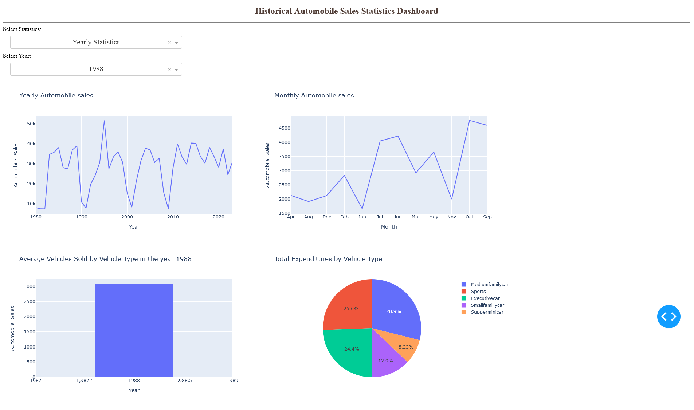

# Historical Automobile Sales Statistics Dashboard with Plotly Dash in Python

This dashboard is created as a part of the IBM Data Analyst Certification program. It provides insights into historical automobile sales statistics, allowing users to analyze trends over the years and during recession periods. The dashboard is designed to meet the project requirements and demonstrate proficiency in data analysis and visualization techniques.

This dashboard was created using [Dash](https://github.com/plotly/dash), a Python framework for building analytical web applications. Graphs are generated using [Plotly Express](https://plotly.com/python/plotly-express/), a high-level interface to Plotly for easy creation of interactive visualizations. [Pandas](https://github.com/pandas-dev/pandas) has also been used to load CSV file into a dataframe and access the data.

You can access the live demo from https://itibaraydemiruslu.pythonanywhere.com/

## Features

**Yearly Statistics:** View trends in automobile sales, advertising expenditure, and other relevant metrics for individual years. 

**Recession Period Statistics:** Analyze automobile sales performance during recession periods and their correlation with factors like unemployment rate and advertising expenditure.

## Deploying the app on PythonAnywhere

After creating an account on PythonAnywhere, you need to do the steps below to deploy the app.

- Upload your files from **Files** tab.
- Create a Bash console
- Create a virtualenv by following [this page](https://help.pythonanywhere.com/pages/Virtualenvs) and run `pip install -r requirements.txt` into it
- Create a new custom webapp on PythonAnywhere
- Configure your webapp to use your **Source code** (main.py), **Working directory**, and **virtualenv** on the PythonAnywhere webapp dashboard
- Edit your **WSGI configuration file** (wsgi.py) as in the example below, and make sure it can find and import your app.

    ```
    import sys

    # add your project directory to the sys.path
    project_home = u'/home/itibaraydemiruslu'
    if project_home not in sys.path:
        sys.path = [project_home] + sys.path

    # need to pass the flask app as "application" for WSGI to work
    # for a dash app, that is at app.server
    # see https://plot.ly/dash/deployment
    from main import app
    application = app.server
    ```
- Reload your webapp and go to your webapp url!


## Running the app locally

1. Install the required packages by running:
    ```
    pip install -r requirements.txt 
    ```
2. Execute this command below:
    ```
    python main.py
    ```
3. Then the Dash app will run on http://127.0.0.1:8050/.

