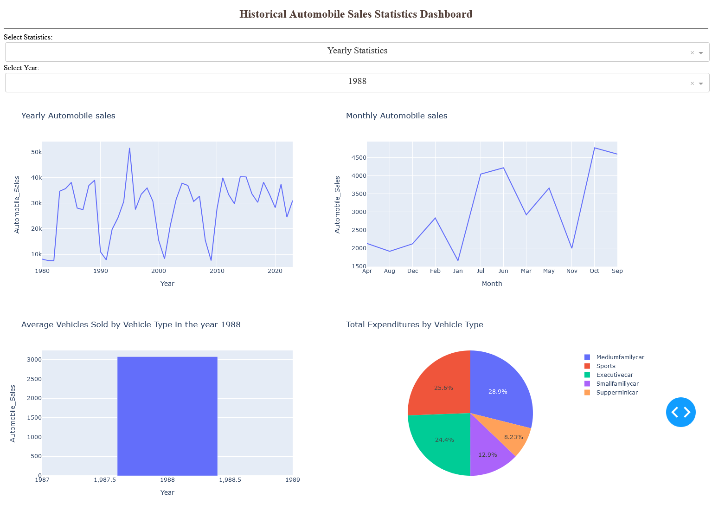

# Historical Automobile Sales Statistics Dashboard with Plotly Dash in Python

This dashboard is created as a part of the IBM Data Analyst Certification program. It provides insights into historical automobile sales statistics, allowing users to analyze trends over the years and during recession periods. The dashboard is designed to meet the project requirements and demonstrate proficiency in data analysis and visualization techniques.

This dashboard was created using [Dash](https://github.com/plotly/dash), a Python framework for building analytical web applications. Graphs are generated using [Plotly Express](https://plotly.com/python/plotly-express/), a high-level interface to Plotly for easy creation of interactive visualizations. [Pandas](https://github.com/pandas-dev/pandas) has also been used to load CSV file into a dataframe and access the data.

## Features

**Yearly Statistics:** View trends in automobile sales, advertising expenditure, and other relevant metrics for individual years. 

**Recession Period Statistics:** Analyze automobile sales performance during recession periods and their correlation with factors like unemployment rate and advertising expenditure.

## Running the app

1. Install the required packages by running:
    ```
    pip install -r requirements.txt 
    ```
2. Execute this command below:
    ```
    python main.py
    ```
3. Then the Dash app will run on http://127.0.0.1:8050/.

